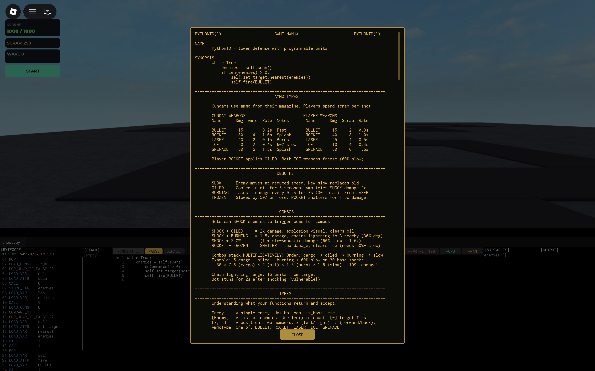
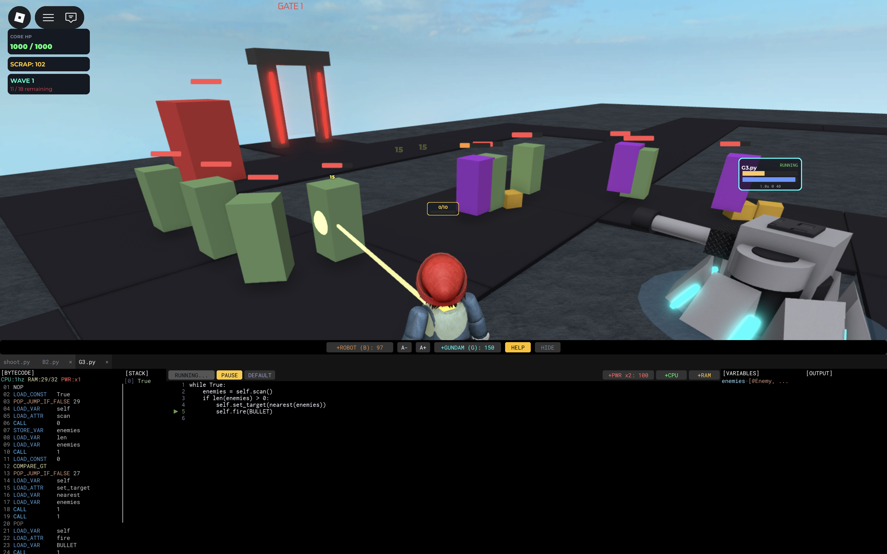
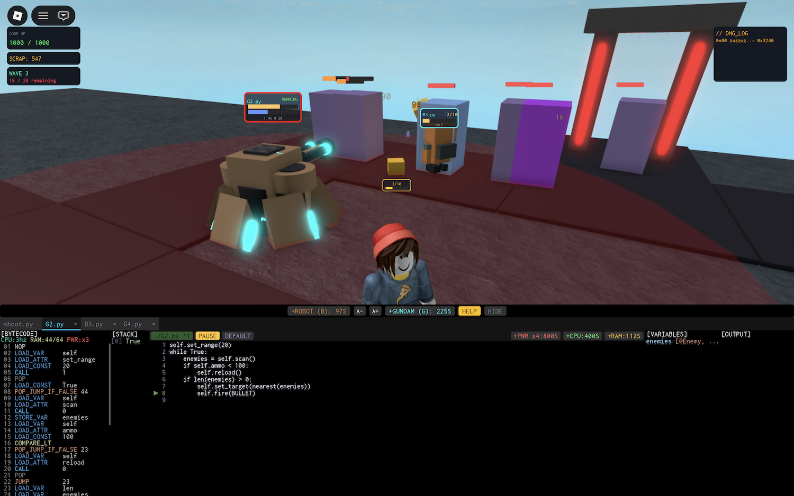

# [PythonTD](https://www.roblox.com/games/92507403623309/Python-Tower-Defense)

> NB: 90% written by AI, nudged by jackdoe; run with rojo serve
Tower defense with programmable units.

```python
while True:
    enemies = self.scan()
    if len(enemies) > 0:
        self.set_target(nearest(enemies))
        self.fire(BULLET)
```




## Ammo Types

Gundams use ammo from their magazine. Player weapons are FREE!

### Gundam Weapons

| Name    | Dmg | Ammo | Rate | Notes    |
|---------|-----|------|------|----------|
| BULLET  | 15  | 1    | 0.2s | Fast     |
| ROCKET  | 80  | 4    | 1.0s | Splash   |
| LASER   | 40  | 2    | 0.1s | Burns    |
| ICE     | 20  | 2    | 0.4s | 60% slow |
| GRENADE | 60  | 5    | 1.5s | Splash   |

### Player Weapons

| Name    | Dmg | Rate |
|---------|-----|------|
| BULLET  | 15  | 0.3s |
| ROCKET  | 40  | 1.0s |
| LASER   | 25  | 0.5s |
| ICE     | 10  | 0.4s |
| GRENADE | 60  | 1.5s |

Player ROCKET applies OILED. Both ICE weapons freeze (60% slow).

## Debuffs

| Debuff  | Effect |
|---------|--------|
| SLOW    | Enemy moves at reduced speed. New slow replaces old. |
| OILED   | Coated in oil for 5 seconds. Amplifies SHOCK damage 2x. |
| BURNING | Takes 5 damage every 0.5s for 3s (30 total). From LASER. |
| FROZEN  | Slowed by 50% or more. ROCKET shatters for 1.5x damage. |

## Combos

Bots can SHOCK enemies to trigger powerful combos:

| Combo | Effect |
|-------|--------|
| SHOCK + OILED   | 2x damage, explosion visual, clears oil |
| SHOCK + BURNING | 1.5x damage, chains lightning to 3 nearby (30% dmg) |
| SHOCK + SLOW    | (1 + slowAmount)x damage (60% slow = 1.6x) |
| ROCKET + FROZEN | SHATTER: 1.5x damage, clears ice (needs 50%+ slow) |

Combos stack **MULTIPLICATIVELY**! Order: cargo -> oiled -> burning -> slow

**Example:** 5 cargo + oiled + burning + 60% slow on 30 base shock:
```
30 × 7.6 (cargo) × 2 (oil) × 1.5 (burn) × 1.6 (slow) = 1094 damage!
```

- Chain lightning range: 15 units from target
- Bot stuns for 2s after shocking (vulnerable!)

## Types

| Type     | Description |
|----------|-------------|
| Enemy    | A single enemy. Has hp, pos, is_boss, etc. |
| [Enemy]  | A list of enemies. Use len() to count, [0] to get first. |
| [x, z]   | A position. Two numbers: x (left/right), z (forward/back). |
| AmmoType | One of: BULLET, ROCKET, LASER, ICE, GRENADE |
| number   | A whole or decimal number like 10, 3.5, -20 |
| bool     | True or False |

## Objects: Self and Others

Each unit (Gundam, Bot, Player) is an OBJECT with data and actions.

### Self - Your Unit

`self` refers to the unit running the code:

```python
self.pos                 # read your position
self.carrying            # read how much scrap you have
self.scan()              # perform a scan action
self.fire(BULLET)        # perform a fire action
```

### Other Units - G1, G2, B1, B2, etc.

You can read data from other units on your team:

```python
B1.pos                   # where is Bot 1?
B1.carrying              # how much scrap does Bot 1 have?
G3.ammo                  # how much ammo does Gundam 3 have?
```

### Properties vs Methods

**Properties** are data you READ (no parentheses):
```python
self.pos                 # [x, z] position
self.carrying            # number of scrap
self.ammo                # current ammo (Gundam)
self.max_ammo            # max ammo capacity (Gundam)
self.max_capacity        # max scrap capacity (Bot/Player)
enemy.hp                 # enemy health
enemy.is_boss            # True/False
```

**Methods** are actions you DO (use parentheses):
```python
self.scan()              # returns list of enemies
self.fire(BULLET)        # shoots, returns True/False
self.collect()           # picks up scrap
self.teleport([0, 0])    # moves to position
self.set_target(enemy)   # aims at enemy
```

### Example - Coordinated Attack

```python
# Bot checks if Gundam needs help
if G1.ammo < 50 and self.carrying > 0:
    self.say("G1 low on ammo!")
    self.teleport([0, 0])
    self.deposit()
```

## Bot Abilities

| Method/Property | Returns | Description |
|-----------------|---------|-------------|
| `self.collect()` | bool | Finds nearest scrap cluster and moves to collect it. |
| `self.deposit()` | bool | Deposits carried scrap at core. Must be within 15 units. |
| `self.shock(enemy)` | bool | Teleports to enemy and zaps for 30 base damage. Triggers combos! Damage scales with cargo: 30 × 1.5^cargo. Consumes HALF cargo (rounded up). |
| `self.teleport([x, z])` | bool | Instantly moves to position. [0,0] is the core. |
| `self.explode()` | bool | Sacrifices 10+ cargo for massive AOE. Bot is destroyed. |
| `self.forward(n)` | bool | Walks forward n units in facing direction. |
| `self.backward(n)` | bool | Walks backward n units. |
| `self.left(degrees)` | bool | Rotates left. Default 90 degrees. |
| `self.right(degrees)` | bool | Rotates right. Default 90 degrees. |
| `self.scan()` | [Enemy] | Returns list of enemies within range 50. |
| `self.say("message")` | nothing | Shows a speech bubble above bot for 3 seconds. |
| `self.carrying` | number | How much scrap bot is carrying. |
| `self.max_capacity` | number | Maximum scrap bot can carry (10). |
| `self.pos` | [x, z] | Current position relative to core. |
| `self.hacker` | Player | Access your owner's player. Use `self.hacker.target()` etc. |

**Shock damage examples:** 5 cargo = 228 dmg, 10 cargo = 1732 dmg!

## Gundam Abilities

| Method/Property | Returns | Description |
|-----------------|---------|-------------|
| `self.fire(AMMO)` | bool | **[BLOCKING]** Fires at current target. Waits for cooldown (scales with CPU). |
| `self.scan()` | [Enemy] | Returns list of enemies within range. |
| `self.set_target(enemy)` | nothing | Locks aim onto an enemy. Required before fire(). |
| `self.target()` | Enemy/None | Returns currently targeted enemy, or None. |
| `self.set_range(n)` | nothing | Sets scan/attack range. Min 10, max 60. Farther = less damage. |
| `self.reload(amount)` | number | Reloads ammo from scrap. Returns amount reloaded. |
| `self.ammo` | number | Current ammo in magazine. |
| `self.max_ammo` | number | Maximum ammo capacity (300). |
| `self.hacker` | Player | Access your owner's player. Use `self.hacker.target()` etc. |
| `self.pos` | [x, z] | Current position relative to core. |

## Player Abilities

| Method/Property | Returns | Description |
|-----------------|---------|-------------|
| `self.fire(AMMO)` | bool | **[BLOCKING]** Fire at target. FREE! Waits for cooldown (scales with CPU). |
| `self.scan()` | [Enemy] | Returns enemies within range 50. |
| `self.set_target(enemy)` | nothing | Lock aim onto an enemy. |
| `self.collect()` | bool | Picks up scrap within range 8. |
| `self.teleport([x, z])` | bool | Instantly moves to position. |
| `self.deposit()` | bool | Deposits scrap at core. Must be within 15 units. |
| `self.drop(n)` | bool | Drops n scrap pieces (costs n×10 from wallet). Share with team! |
| `self.explode()` | bool | AOE attack that consumes carried scrap. |
| `self.carrying` | number | How much scrap player is carrying. |
| `self.max_capacity` | number | Maximum scrap player can carry (10). |
| `self.hacker` | Player | Returns yourself. Try `self.hacker.hacker.hacker.target()`! |
| `self.pos` | [x, z] | Current position relative to core. |

## Selectors

These pick ONE enemy from a list:

| Function | Description |
|----------|-------------|
| `nearest([Enemy])` | Returns enemy closest to you. |
| `furthest([Enemy])` | Returns enemy farthest from you. |
| `weakest([Enemy])` | Returns enemy with lowest HP. |
| `strongest([Enemy])` | Returns enemy with highest HP. |

**Example:**
```python
enemies = self.scan()          # get list of enemies
target = nearest(enemies)      # pick the closest one
self.set_target(target)        # aim at it
```

## Enemy Properties

When you scan, you get Enemy objects:

| Property | Type | Description |
|----------|------|-------------|
| `enemy.hp` | number | Current health |
| `enemy.max_hp` | number | Maximum health |
| `enemy.pos` | [x, z] | Position |
| `enemy.is_boss` | bool | Is it a boss? |
| `enemy.burning` | bool | Is it on fire? |
| `enemy.frozen` | bool | Is it frozen (50%+ slow)? |
| `enemy.slowed` | bool | Is it slowed at all? |
| `enemy.oiled` | bool | Is it oiled? |

## Global Variables

| Variable | Description |
|----------|-------------|
| `CORE.hp` | Current core health |
| `CORE.pos` | Core position [0, 0] |
| `G1, G2, ... G10` | Access other gundams by ID |
| `B1, B2, B3, B4` | Access bots by ID |

## How Python Works

Your code goes through 3 stages before running:

1. **LEXER** - Reads your text and breaks it into tokens. `if x > 5:` becomes: [IF] [x] [>] [5] [:]. Tracks indentation for Python blocks.

2. **COMPILER** - Converts tokens into bytecode instructions. `x = 5` becomes: LOAD_CONST 5, STORE_VAR x. Checks for errors like undefined variables.

3. **VIRTUAL MACHINE (VM)** - Executes bytecode one instruction at a time. Uses a stack to compute values. Each CPU tick runs multiple instructions.

## CPU and RAM

Each unit has CPU speed (Hz) and RAM (bytes).

### CPU (Speed)

- Base: 1 Hz
- Each upgrade: +2 Hz
- Cost: 100 scrap, then x1.5 per upgrade

| Upgrade | Cost |
|---------|------|
| 1 Hz -> 3 Hz | 100 scrap |
| 3 Hz -> 5 Hz | 150 scrap |
| 5 Hz -> 7 Hz | 225 scrap |

Higher Hz = your program runs faster AND you fire faster!
- Fire rate scales with CPU: `actualRate = baseRate / cpuHz`
- At 5 Hz with BULLET (0.2s): fires every 0.04s instead of 0.2s!
- Bot movement speed also scales: `baseSpeed + (cpuHz - 1) × 4`

`fire()` is **BLOCKING** - your program waits for the cooldown.

### RAM (Program Size)

- Base: 32 bytes
- Each upgrade: +32 bytes
- Cost: 75 scrap, then x1.5 per upgrade

| Upgrade | Cost |
|---------|------|
| 32B -> 64B | 75 scrap |
| 64B -> 96B | 112 scrap |
| 96B -> 128B | 168 scrap |

RAM limits your program size (bytecode instructions).
- Simple loop = ~15 bytes
- Full AI = ~60+ bytes

## Economy

- Each player has their own scrap balance (not shared!)
- Scrap drops from killed enemies
- Your bots deposit scrap to YOUR balance
- Use `self.drop(n)` to share scrap with teammates
- Each scrap piece = 10 scrap currency

### Costs

| Item | Cost |
|------|------|
| Gundam | 100 scrap base (increases per gundam) |
| Bot | 75 scrap base (increases per bot) |
| CPU/RAM upgrades | See tables above |

## First Challenge

The default gundam program fires but **NEVER RELOADS!**

```python
while True:
    enemies = self.scan()
    if len(enemies) > 0:
        self.set_target(nearest(enemies))
        self.fire(BULLET)
```

Your first task: add reload logic. But there's a catch...

**Base RAM (32 bytes) is NOT enough for a full reload program!**

You must choose wisely:
- Write minimal code that fits in 32 bytes
- Or upgrade RAM first (costs scrap)
- Or accept running dry and reloading manually

This is the machinist's dilemma: code efficiency vs upgrades.

## Tips

- ICE enemies before ROCKET for shatter bonus (freezes at 50%+ slow)
- SHOCK oiled enemies for 2x damage + explosion
- SHOCK burning enemies for 1.5x + chain lightning
- Stack debuffs before SHOCK for multiplicative damage!
- SHOCK teleports bot to target, then consumes all cargo
- Bots can `teleport([0,0])` to instantly return to core
- Higher gundam range = less damage (40 / range multiplier)
- Check `enemy.is_boss` to prioritize threats
- Use `B1.carrying` to coordinate between units
